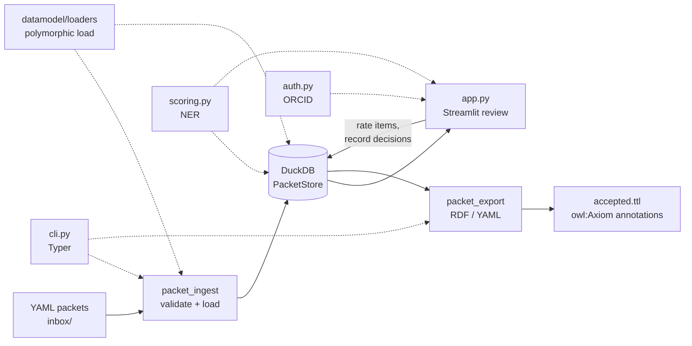

# Architecture

SIEVE turns YAML **evidence packets** into curated, machine-readable axioms. This
page describes how the running system is put together: the modules, how they
talk to a DuckDB store, and how a packet flows from authoring to RDF export. For
the packet shape itself, start with the [Primer](primer.md); for the
field-by-field model, see the [Data Model](data-model.md).

## The pieces



Everything is built on the generated Pydantic model in
`datamodel/sieve_models.py`. Ingest, storage, the UI and export all pass the
same `EvidencePacket` objects around.

## Modules

### `datamodel/` — the model

- **`sieve_models.py`** — Pydantic classes generated from `schema/sieve.yaml`
  (`EvidencePacket`, `SieveStatement`, `SieveEvidenceLine`, the evidence-item
  subclasses `ConcordanceItem` / `SieveDocument` / `SieveDataItem` /
  `SieveStudyResult` / `ComputationalResult` / `AgentContribution`,
  `CurationDecision`, `DecisionType`, and supporting types). Re-exported from
  `datamodel/__init__.py`.
- **`loaders.py`** — polymorphic loading. Evidence items are a union of
  `InformationEntity` subclasses, and validating them through the base class
  drops subclass-specific fields. `load_packet(path)` / `packet_from_dict(data)`
  dispatch each item to its concrete class via the `type:` discriminator
  (`EVIDENCE_ITEM_TYPES`, which also aliases the bare `Document` / `DataItem` /
  `StudyResult` names) before validating the whole packet.

### `packet_ingest.py` — YAML in

- `validate_packet_dict(data)` validates a packet dict against the merged LinkML
  schema (`schema/sieve.yaml` with imports resolved) and returns the list of
  validation results (empty means valid).
- `ingest_packet_file(path, store)` loads one YAML packet (via `load_packet`)
  and inserts it.
- `ingest_packet_directory(path, store)` walks `**/*.yaml` / `**/*.yml`,
  ingesting each and returning per-file stats (`files`, `success`, `errors`,
  `error_details`).

### `store.py` — the DuckDB store

`PacketStore` wraps a DuckDB connection (default `data/sieve.duckdb`,
`:memory:` for tests) and owns the schema. It stores the full packet as JSON
plus a handful of promoted columns for querying:

- `insert_packet(packet)` — upsert; recomputes `evidence_score` (NER) and the
  steward, and serializes the packet with `serialize_as_any=True` so polymorphic
  items keep their subclass fields.
- `get_packet(id)` — reload an `EvidencePacket` from stored JSON (through the
  polymorphic loader).
- `list_packets(status=None)` — promoted columns for the queue/dashboard.
- `get_stats()` — packet counts grouped by status.
- `update_status(id, status)` — set status on the packet and re-store.
- `set_item_rating(id, item_id, rating)` — set a single evidence item's steward
  rating (`ACCEPTED` / `REJECTED`) by item id.
- `record_decision(decision)` / `get_decisions(id)` — append a
  `CurationDecision` and read the history (newest first).

### `scoring.py` — Net Evidence Ratio

`net_evidence_ratio(packet)` collapses the evidence lines into one number in
`[-1, +1]`. Each line contributes a weight — its explicit
`score_of_evidence_provided`, else a value mapped from
`strength_of_evidence_provided` (`strong`=1.0, `moderate`=0.6, `weak`=0.3), else
1.0 (`line_score`). Lines are bucketed by `direction_of_evidence_provided`:

```text
        S+ (supports)  −  S− (disputes)
NER = ─────────────────────────────────────
        S+  +  S−  +  S0 (neutral / other)
```

(0.0 when there are no lines.) The store persists this as `evidence_score`; the
UI shows it live.

### `cli.py` — Typer CLI

Four commands:

- `sieve run` — launch the Streamlit app (`streamlit run src/sieve/app.py`).
- `sieve ingest -I <dir> [--db <path>]` — ingest a directory into the store.
- `sieve validate (-i <file> | -I <dir>)` — validate against the schema; exits
  non-zero on any errors.
- `sieve export (-i <file> | -I <dir>) [-o <out>] [-O <format>]` — export loaded
  packets. `-O` accepts RDF flavours (`rdf`/`turtle`/`ttl`, `xml`, `n3`, `nt`)
  or `yaml`.

### `app.py` — Streamlit review UI

A single-page app with a sidebar (live stats, ORCID login) and four views:

- **Dashboard** — packet counts by status.
- **Review Queue** — pick a status, open a packet, and see its statement,
  evidence lines/items, and NER. Authorized curators get per-item **Accept
  item** / **Reject item** buttons (`set_item_rating`) and an
  **Accept / Reject / Controversial** decision panel that writes a
  `CurationDecision` (`record_decision`) and updates the packet status
  (`update_status`).
- **Ingest** — ingest a directory through the UI.
- **Export** — serialize the `ACCEPTED` packets to Turtle.

### `auth.py` — ORCID authentication

ORCID OAuth 2.0 (sandbox or production, selected by config) with an authorized-
curator allowlist read from `curators.yaml` (roles `admin` / `curator`).
`is_authorized_curator` / `get_curator_info` gate the write controls in the UI;
`SIEVE_DEV_MODE=true` bypasses login and records decisions as a placeholder
curator. Secrets come from Streamlit secrets or the environment.

### `packet_export.py` — RDF and YAML out

- `export_packets_to_yaml(packets, path)` / `packet_to_yaml(packet)` — round-trip
  YAML (again with `serialize_as_any=True`).
- `packet_to_rdf(packet, graph=None)` / `export_packets_to_rdf(packets, path,
  format)` — emit OWL axiom annotations (see below).

## Data flow

**Ingest.** `sieve ingest` (or the UI) walks a directory, loads each YAML file
into an `EvidencePacket` through the polymorphic loader, and calls
`store.insert_packet`, which computes the NER and writes JSON + promoted columns
to DuckDB.

**Review.** The Streamlit app reads packets from the store, shows statement,
evidence and NER, and lets an authorized curator rate individual items and
record a decision. Ratings and decisions are written straight back to the store,
and the packet's status moves `UNREVIEWED → ACCEPTED / REJECTED / CONTROVERSIAL`.

**Export.** `sieve export` loads packets (from files) and serializes them to RDF
or YAML. The UI export view pulls the `ACCEPTED` packets from the store and
serializes them to Turtle.

## Storage schema

Two tables, created on connect by `PacketStore._init_schema`.

### `evidence_packets`

| Column | Type | Notes |
|--------|------|-------|
| `id` | VARCHAR (PK) | Packet id |
| `subject_id` | VARCHAR | Statement subject CURIE |
| `predicate` | VARCHAR | Statement predicate `code` |
| `object_id` | VARCHAR | Statement object CURIE |
| `status` | VARCHAR | `UNREVIEWED` / `ACCEPTED` / `REJECTED` / `CONTROVERSIAL` |
| `evidence_score` | DOUBLE | NER, recomputed on every insert |
| `evidence_steward` | VARCHAR | Steward id from `curated_by.contributor` |
| `created` | VARCHAR | |
| `updated` | VARCHAR | |
| `packet_json` | JSON | Full serialized packet (source of truth for reload) |

### `packet_decisions`

| Column | Type | Notes |
|--------|------|-------|
| `id` | VARCHAR (PK) | Decision id |
| `packet_id` | VARCHAR | The packet decided on |
| `curator` | VARCHAR | Curator ORCID |
| `curator_name` | VARCHAR | |
| `decision` | VARCHAR | `ACCEPT` / `REJECT` / `CONTROVERSIAL` |
| `rationale` | VARCHAR | Optional |
| `certainty` | DOUBLE | Optional confidence |
| `decided_at` | VARCHAR | Timestamp |

The full packet lives in `packet_json`; the other columns are promoted copies
for filtering and listing, refreshed whenever the packet is re-inserted.

## RDF export

`packet_to_rdf` emits an `owl:Axiom` reifying the statement, annotated with the
evidence. Only reviewed packets produce triples — a packet whose status is not
one of `ACCEPTED` / `REJECTED` / `CONTROVERSIAL` is skipped with a warning.
CURIEs are expanded to full URIs via the OBO converter (`curies`), with special
handling for `orcid:`, `rdfs:`, `owl:` and already-expanded URLs.

```turtle
[] a owl:Axiom ;
   owl:annotatedSource   <subject> ;
   owl:annotatedProperty <predicate> ;      # defaults to rdfs:subClassOf
   owl:annotatedTarget   <object> ;
   SEPIO:0000124         <packet_uri> .      # "has evidence"
```

Status then adds provenance:

- **ACCEPTED** — `oboInOwl:source` with the steward ORCID, plus one
  `oboInOwl:source` per accepted item source. Those sources come from
  **ACCEPTED-rated items on supporting lines only** (`_accepted_item_sources`):
  their `pmid` / `doi` / `source_id` / `source_subject`, and any contributor id.
- **REJECTED** — `IAO:0000233` (term-tracker item) pointing at the packet, plus
  the steward `oboInOwl:source`.
- **CONTROVERSIAL** — an `rdfs:comment` flagging the controversy, `IAO:0000233`,
  and the steward `oboInOwl:source`.

## Design notes

- **DuckDB** — embedded, single-file, no server; native JSON so the whole packet
  can live in one column with promoted columns for queries.
- **Full-JSON storage** — `packet_json` is the source of truth; the flat columns
  are derived and rebuilt on every insert, so the model schema can evolve without
  a migration.
- **LinkML + generated Pydantic** — the schema (`schema/sieve.yaml`) drives both
  validation and the runtime model, keeping the two in step.
- **YAML packets** — human-readable, diff-friendly, and easy to keep under
  version control alongside ontology work.
