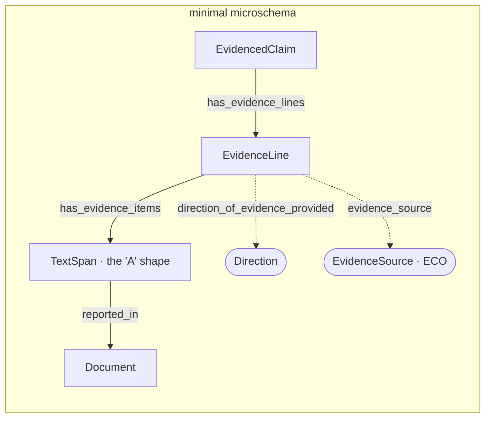
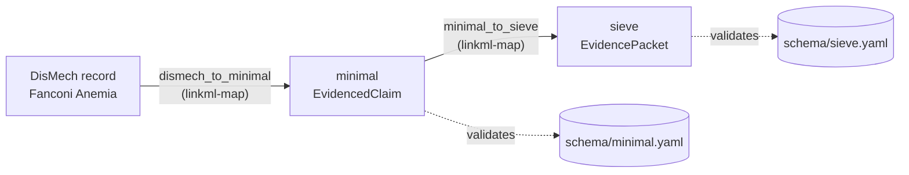

# The Minimal Evidence Microschema

This page introduces the **minimal evidence microschema** — a small, standalone
model for "evidence that supports or disputes a claim" that any Monarch project can
import and reuse — and shows it working on a real record: a DisMech pathophysiology
assertion for Fanconi Anemia is transformed into the minimal model, then lifted into
the full [sieve](index.md) model. Every step below is executable:

```bash
just transform-all      # DisMech -> minimal -> sieve, both outputs validated
```

!!! note "Status"
    The minimal model is **provisional** pending coordination with the SEPIO project
    (schema `id` and the enum-to-ontology `meaning:` IRIs are not yet final). See the
    design spec `specs/2026-07-31-minimal-microschema-and-sieve-alignment-design.md`.

## Why a *minimal* model

Many projects independently model the same thing — a claim, and the evidence for or
against it — and each does it slightly differently. The minimal microschema is the
small shared core everyone can agree on: one `EvidenceLine` grouping one or more
`TextSpan` evidence items, each drawn from a `Document`. It is deliberately lean so it
is easy to adopt, and it is **SEPIO-aligned by `class_uri`/`slot_uri`** (not by
importing SEPIO), so its instances *are* SEPIO evidence without dragging in the whole
SEPIO model.



The model has three concepts and three enums:

| Concept | What it is | SEPIO `class_uri` |
| --- | --- | --- |
| `EvidencedClaim` | a claim plus the evidence lines bearing on it | `sepio:Statement` |
| `EvidenceLine` | one line of reasoning, with a single direction + source | `sepio:EvidenceLine` |
| `TextSpan` (**A**) | a verbatim text span used as evidence, plus its document | `sepio:DataItem` |
| `Document` | the publication a span was drawn from | `sepio:Document` |

`Direction` (`SUPPORTS`/`REFUTES`/`NEUTRAL` — polarity only), `Strength`
(`STRONG`/`MODERATE`/`WEAK` — kept separate from direction), `EvidenceSource`
(`HUMAN_CLINICAL`/`MODEL_ORGANISM`/…, each mapping onto an ECO branch), and
`DocumentType` round it out.
A future `TextMiningResult` (**C**) will subclass `TextSpan` to carry extraction
metadata (score, offsets, method) — so the minimal "A" shape stays valid while richer
"C" evidence is *is-a* compatible.

## The transform, in one picture



Both hops are [linkml-map](https://linkml.io/linkml-map/) transformation specs in
`transform/`. The source shape is a vendored snapshot of DisMech's model
(`transform/dismech_source.yaml`) so the pipeline runs without the DisMech repo
checked out.

## Before: a DisMech assertion

DisMech records pathophysiology as a claim (`name` + `description`) with a **flat list
of evidence items**. Each item is a verbatim `snippet` from a `reference`, tagged with
a `supports` direction and an `evidence_source`. Here is the "Hematopoietic Stem Cell
Attrition" node from the Fanconi Anemia record
(`transform/dismech_fanconi_input.yaml`), lightly trimmed:

```yaml
name: Hematopoietic Stem Cell Attrition
description: Progressive depletion of long-term hematopoietic stem cells ...
evidence:
  - reference: PMID:38424108
    reference_title: "Deregulated protein homeostasis constrains fetal HSC pool expansion in Fanconi anemia."
    supports: SUPPORT
    evidence_source: MODEL_ORGANISM
    snippet: "proteostasis deregulation itself is driven by excess sterile inflammatory activity ..."
    explanation: Demonstrates that inflammatory signaling drives HSC pool deficits in FA ...
  - reference: PMID:24037726
    reference_title: "Variant ALDH2 is associated with accelerated progression of bone marrow failure ..."
    supports: PARTIAL
    evidence_source: HUMAN_CLINICAL
    snippet: "the FA proteins might counteract aldehyde-induced genotoxicity in hematopoietic stem cells"
    explanation: Establishes that aldehydes cause genotoxicity in HSCs ...
```

## After: the minimal model

The transform (`transform/dismech_to_minimal.transform.yaml`) makes the assertion an
`EvidencedClaim` and turns **each DisMech evidence item into its own `EvidenceLine`**
holding a single `TextSpan`. The per-item `supports`/`evidence_source` — which DisMech
stores on the item — move up to the line, matching the minimal rule that *one line has
one direction and one source*. Crucially, DisMech's `supports` enum conflates three
things, so the transform **splits** it: `SUPPORT`/`REFUTE` become the `direction`;
`PARTIAL` becomes `direction: SUPPORTS` **plus** `strength: WEAK` (partial support is a
*strength*, not a direction); and the operational values (`NO_EVIDENCE`,
`WRONG_STATEMENT`) are curation signals that don't belong in the evidence model at all.
The `snippet` becomes the span's `value`, and `reference` + `reference_title` become its
`Document`:

```yaml
statement_text: Hematopoietic Stem Cell Attrition
has_evidence_lines:
  - direction_of_evidence_provided: SUPPORTS
    evidence_source: MODEL_ORGANISM
    description: Demonstrates that inflammatory signaling drives HSC pool deficits in FA ...
    has_evidence_items:
      - value: "proteostasis deregulation itself is driven by excess sterile inflammatory activity ..."
        reported_in:
          id: PMID:38424108
          title: "Deregulated protein homeostasis constrains fetal HSC pool expansion in Fanconi anemia."
  - direction_of_evidence_provided: SUPPORTS
    strength_of_evidence_provided: WEAK      # dismech PARTIAL -> direction + strength
    evidence_source: HUMAN_CLINICAL
    description: Establishes that aldehydes cause genotoxicity in HSCs ...
    has_evidence_items:
      - value: "the FA proteins might counteract aldehyde-induced genotoxicity in hematopoietic stem cells"
        reported_in:
          id: PMID:24037726
          title: "Variant ALDH2 is associated with accelerated progression of bone marrow failure ..."
```

This output validates against `schema/minimal.yaml`.

!!! tip "One line per item — and when to merge"
    The mechanical transform gives one line per DisMech item. That is correct here,
    because the two items differ in source (model organism vs human clinical) and
    strength (full vs partial/`WEAK`). When several items share a direction *and*
    strength *and* source *and* document, a curation step may merge them into a single
    line with several `has_evidence_items` — an `EvidenceLine` is a line of reasoning,
    not a sentence.

## Lifting into sieve

The full sieve model is a superset. The second transform
(`transform/minimal_to_sieve.transform.yaml`) lifts the minimal claim into a sieve
`EvidencePacket`: each `EvidenceLine` becomes a `SieveEvidenceLine`, and each
`TextSpan` becomes a `SieveDocument` evidence item — the snippet becomes its `quote`,
and the `Document` becomes its `pmid` + `title`:

```yaml
id: sieve:packet_fanconi_hsc_attrition
status: UNREVIEWED
statement:
  id: stmt_fanconi_hsc_attrition
  type: SieveStatement
  statement_text: Hematopoietic Stem Cell Attrition
has_evidence_lines:
  - id: line_pmid38424108
    type: SieveEvidenceLine
    direction_of_evidence_provided: supports
    description: Demonstrates that inflammatory signaling drives HSC pool deficits in FA ...
    has_evidence_items:
      - id: doc_38424108
        type: SieveDocument
        quote: "proteostasis deregulation itself is driven by excess sterile inflammatory activity ..."
        pmid: "38424108"
        title: "Deregulated protein homeostasis constrains fetal HSC pool expansion in Fanconi anemia."
  # ... second line likewise
```

This output validates against `schema/sieve.yaml`. The lift shows what the richer model
adds: **every entity gets an `id` and a `type` designator**, and evidence items become
typed sieve classes (`SieveDocument`, `ConcordanceItem`, …) carrying curation slots
(`rating`, `eco_code`). One thing the minimal model has that sieve does not yet: the
line-level `evidence_source` axis — that is a held extension (spec phase 4), so it is
intentionally dropped in the lift for now.

## Files

| File | Role |
| --- | --- |
| `schema/minimal.yaml` | the minimal microschema |
| `transform/dismech_source.yaml` | vendored snapshot of the DisMech evidence shape |
| `transform/dismech_fanconi_input.yaml` | the input Fanconi assertion |
| `transform/dismech_to_minimal.transform.yaml` | DisMech → minimal transform |
| `transform/minimal_to_sieve.transform.yaml` | minimal → sieve transform |
| `project.justfile` | `transform-dismech`, `transform-minimal-to-sieve`, `transform-all` |
| `tests/test_transform_dismech.py` | runs the pipeline and validates both outputs |
