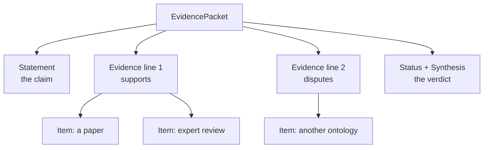
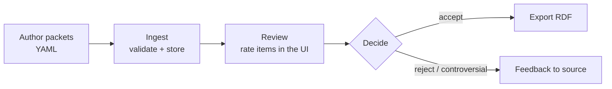

# SIEVE in Plain Terms

SIEVE records **why we believe an assertion** — and packages that "why" so a
curator (or a machine) can check it.

An *assertion* is a single claim, like:

> asthma **is a kind of** respiratory system disorder

SIEVE wraps that claim together with the evidence for and against it into one
**evidence packet**:

```yaml
statement:
  subject: MONDO:0004979        # asthma
  predicate: {code: rdfs:subClassOf}
  object: MONDO:0005275         # respiratory system disorder
hasEvidenceLines:
  - directionOfEvidenceProvided: supports
    hasEvidenceItems:
      - type: SieveDocument
        pmid: "28884740"
        quote: "Asthma is a heterogeneous disease… of chronic airway inflammation."
```

That is the whole idea. The rest of this page shows what goes in the box.

---

## The shape of a packet

Every packet has the same three parts: **one statement**, some **evidence
lines**, and a **verdict**.



- **Statement** — the one claim being judged.
- **Evidence line** — *one argument*, either for or against the claim.
- **Evidence item** — *one piece of information* inside that argument (a paper, a
  database record, an expert's note, a computation).
- **Verdict** — the status (`UNREVIEWED` → `ACCEPTED` / `REJECTED` /
  `CONTROVERSIAL`) and an optional plain-language synthesis.

> **Why two levels (lines *and* items)?** A single argument can rest on several
> pieces of evidence. "Three papers and a clinician all say the same thing" is
> *one* line of support built from *four* items.

---

## The statement

Subject → predicate → object. Labels are optional but make packets readable.

```yaml
statement:
  subject: MONDO:0004979
  subjectLabel: asthma
  predicate:
    code: rdfs:subClassOf
    label: subClassOf
  object: MONDO:0005275
  objectLabel: respiratory system disorder
  statementText: asthma subClassOf respiratory system disorder
```

---

## The evidence: lines made of items

A line says **which way** the evidence points and **how strongly**; its items
carry the actual content.

```yaml
hasEvidenceLines:
  - directionOfEvidenceProvided: supports     # supports | disputes | neutral
    strengthOfEvidenceProvided: strong        # strong | moderate | weak
    scoreOfEvidenceProvided: 0.9              # 0–1, used for scoring
    hasEvidenceItems:
      - type: SieveDocument
        pmid: "28884740"
        quote: "Asthma is… characterized by chronic airway inflammation."
        rating: ACCEPTED                       # the curator's per-item verdict
```

---

## Kinds of evidence

Pick the item `type` that matches where the evidence comes from. Each example is
one item you'd drop into a line's `hasEvidenceItems`.

=== "Another ontology agrees (ConcordanceItem)"

    ```yaml
    - type: ConcordanceItem
      sourceName: ICD-10-CM
      sourceSubject: ICD10CM:J45
      sourceObject: ICD10CM:J00-J99          # "Diseases of the respiratory system"
      mappingSet: https://w3id.org/sssom/mappings/mondo-icd10.sssom.tsv
    ```

=== "A publication (SieveDocument)"

    ```yaml
    - type: SieveDocument
      title: Pathophysiology of Asthma
      pmid: "31542051"
      quote: "Asthma is a chronic inflammatory disorder of the airways…"
      quoteLocation: Abstract
    ```

=== "A person weighed in (AgentContribution)"

    ```yaml
    - type: AgentContribution
      contributor: {id: orcid:0000-0003-4567-8901, name: Dr. Sarah Chen}
      trustLevel: domain_expert                # community | domain_expert | curator | authority
      contributionType: review                 # suggestion | review | decision | provision
      content: "Confirmed: asthma is a respiratory disorder."
      reference: https://github.com/monarch-initiative/mondo/issues/7890
    ```

=== "A computation (ComputationalResult)"

    ```yaml
    - type: ComputationalResult
      methodName: ChatGPT Deep Research
      value: "0.92"
      parameters: "Analysed 47 sources; unanimous respiratory classification."
    ```

Any item can also carry a curator `rating` and an `eco_code` (an
[Evidence & Conclusion Ontology](https://www.evidenceontology.org/) term saying
*what kind* of evidence it is).

---

## From evidence to a score

Each line pushes the claim up (**supports**), down (**disputes**), or sideways
(**neutral**), weighted by its score. SIEVE sums these into a single **Net
Evidence Ratio** between −1 (all against) and +1 (all for):

```text
        (sum of SUPPORTING scores) − (sum of DISPUTING scores)
NER = ─────────────────────────────────────────────────────────
        (supporting) + (disputing) + (neutral) scores
```

Worked example — three supporting lines, one disputing:

| Line | Direction | Score |
|------|-----------|-------|
| ICD-10 concordance | supports | 0.9 |
| GINA guideline | supports | 0.95 |
| Expert review | supports | 0.8 |
| Disease Ontology | disputes | 0.7 |

```text
NER = ((0.9 + 0.95 + 0.8) − 0.7) / (0.9 + 0.95 + 0.8 + 0.7)
    = 1.95 / 3.35
    ≈ +0.58
```

A clearly positive score — the evidence leans strongly toward *accept*.

---

## The workflow



```bash
sieve validate -I inbox/examples/      # check packets against the schema
sieve ingest   -I inbox/examples/      # load them into the database
sieve run                              # review + decide in the browser
sieve export   -I inbox/examples/ -O rdf -o accepted.ttl
```

---

## What comes out

An accepted packet becomes an **annotated axiom** — the original claim, plus a
machine-readable trail of who backed it and with what evidence:

```turtle
[] a owl:Axiom ;
   owl:annotatedSource   MONDO:0004979 ;      # asthma
   owl:annotatedProperty rdfs:subClassOf ;
   owl:annotatedTarget   MONDO:0005275 ;      # respiratory system disorder
   SEPIO:0000124  <…the evidence packet…> ;   # "has evidence"
   oboInOwl:source  orcid:0000-0002-6601-2165 ,   # the steward
                    "28884740" .                    # an accepted source
```

---

## Where this comes from

SIEVE's model is a friendly, focused layer over
[**SEPIO**](https://github.com/monarch-initiative/SEPIO-ontology) (the Scientific
Evidence and Provenance Information Ontology) — the same evidence backbone used
across Monarch. You author the simple shape above; underneath, every packet is
valid SEPIO, so evidence means the same thing everywhere.

For the full field-by-field model, see the [Data Model](data-model.md) page and
`SPEC.md` in the repository.
