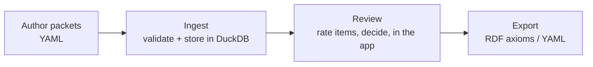

# Workflows

End-to-end recipes for getting evidence into SIEVE, curating it, and getting
axioms back out. If you are new to the packet shape, read the
[Primer](primer.md) first; for full command options see the
[CLI Reference](cli.md), and for every field see the [Data Model](data-model.md).

SIEVE runs in three phases:



```bash
sieve validate -I inbox/examples/           # 0. check packets against the schema
sieve ingest   -I inbox/examples/           # 1. load them into DuckDB
sieve run                                   # 2. review + decide in the browser
sieve export   -I inbox/examples/ -O rdf -o accepted.ttl   # 3. emit RDF
```

---

## 1. Author a packet by hand

A packet is one YAML file: a single **statement**, one or more **evidence
lines**, and each line's **evidence items**. The `type:` field on each entity is
the discriminator — it tells SIEVE which class an item is (`SieveDocument`,
`ConcordanceItem`, `AgentContribution`, `ComputationalResult`, …). This is the
minimal valid shape:

```yaml
id: sieve:pkt_asthma_0001
status: UNREVIEWED
statement:
  id: stmt_asthma_0001
  type: SieveStatement
  subject: MONDO:0004979
  subject_label: asthma
  predicate:
    code: rdfs:subClassOf
    label: subClassOf
  object: MONDO:0005275
  object_label: respiratory system disorder
  statement_text: asthma subClassOf respiratory system disorder
has_evidence_lines:
  - id: line_0001
    type: SieveEvidenceLine
    direction_of_evidence_provided: supports      # supports | disputes | neutral
    strength_of_evidence_provided: strong         # strong | moderate | weak
    score_of_evidence_provided: 0.9               # 0–1, used for scoring
    has_evidence_items:
      - id: ev_document_0001
        type: SieveDocument
        title: Pathophysiology of Asthma
        pmid: "31542051"
        quote: Asthma is a chronic inflammatory disorder of the airways.
```

Notes:

- Every entity (`statement`, each line, each item) needs both an `id` and a
  `type`. Evidence is authored as explicit lines — nothing is auto-wrapped.
- `status` starts at `UNREVIEWED`; the curator sets the verdict later.
- Items may carry a `rating` (`ACCEPTED` / `REJECTED`) and an `eco_code`, but a
  freshly authored packet usually leaves those to the reviewer.
- For the other evidence-item kinds and every available field, see the
  [Primer](primer.md#kinds-of-evidence) and the [Data Model](data-model.md).

Drop the file into a directory (conventionally `inbox/`) and validate it:

```bash
sieve validate -i inbox/pkt_asthma_0001.yaml
```

A working, richer example lives at
`tests/data/valid/example_packet.yaml` in the repository.

---

## 2. Ingest into DuckDB

`sieve ingest` loads every `*.yaml` / `*.yml` packet under a directory into a
DuckDB database (default `data/sieve.duckdb`). Each packet is validated and
loaded, its full JSON is stored, and its Net Evidence Ratio is computed and
promoted to a column for sorting.

```bash
# Ingest the default inbox/ directory
sieve ingest

# Ingest a specific directory into a specific database
sieve ingest -I inbox/examples/ --db data/sieve.duckdb
```

Output reports how many of the discovered files loaded, and prints per-file
errors for any that failed (ingest keeps going rather than aborting the batch):

```text
Ingested 15 of 16 packets
Errors: 1
  inbox/examples/broken.yaml: ...
```

Re-ingesting a packet with an existing `id` overwrites it (`INSERT OR REPLACE`),
so you can fix a file and re-run without clearing the database.

---

## 3. Review in the app

Launch the Streamlit app:

```bash
sieve run
```

The sidebar shows live counts per status and, below them, the login panel. The
four pages are **Dashboard**, **Review Queue**, **Ingest**, and **Export**.

### Log in as a curator

Rating and deciding require an **authorised curator**. You can:

- Sign in with ORCID (if OAuth is configured), or
- Enter your ORCID and name manually in the sidebar (fallback when OAuth is not
  configured), or
- Set `SIEVE_DEV_MODE=true`, which bypasses auth entirely — every action is
  allowed and decisions are recorded as `Dev Mode User`.

Authorisation is checked against `curators.yaml` (see
[section 7](#7-orcid-auth-and-curators) and the [ORCID Setup](orcid-setup.md)
page). Without login you can browse packets read-only but cannot rate or decide.

### Work a packet

On **Review Queue**, pick a status (`UNREVIEWED`, `ACCEPTED`, `REJECTED`,
`CONTROVERSIAL`) and choose a packet from the list. Each entry is labelled with
its id, `subject → object`, and its NER, e.g.:

```text
sieve:pkt_asthma_0001  ·  MONDO:0004979 → MONDO:0005275  (NER 0.90)
```

The packet detail view shows the statement, the current status and NER, and each
evidence line with its items. For every evidence item you (as an authorised
curator) get two buttons:

- **Accept item** — sets the item's `rating` to `ACCEPTED`
- **Reject item** — sets the item's `rating` to `REJECTED`

Item ratings matter downstream: only `ACCEPTED` items on **supporting** lines
contribute sources to the RDF export.

### Record the decision

Below the evidence, the **Decision** section shows the decision history and — for
authorised curators — a rationale box and three buttons:

| Button | Records decision | Sets packet status |
|--------|------------------|--------------------|
| **Accept** | `ACCEPT` | `ACCEPTED` |
| **Reject** | `REJECT` | `REJECTED` |
| **Controversial** | `CONTROVERSIAL` | `CONTROVERSIAL` |

Clicking a button writes a `CurationDecision` (curator ORCID + name, the
decision, optional rationale, timestamp) to the decision history and updates the
packet's status. Decisions are append-only history; each click adds a new row.

> The **Ingest** and **Export** sidebar pages mirror the CLI: Ingest loads
> packets from a directory you type in; Export renders the RDF for the packets
> currently `ACCEPTED` in the database.

---

## 4. Export to RDF and YAML

`sieve export` reads packet **YAML files from disk** and emits RDF or YAML. Each
packet's own `status:` field decides what is produced.

```bash
# One file → RDF Turtle on stdout
sieve export -i packet.yaml -O rdf

# A directory → a single Turtle file
sieve export -I exports/accepted/ -O rdf -o accepted.ttl

# Combine packets into one multi-document YAML file
sieve export -I packets/ -O yaml -o combined.yaml
```

RDF formats: `rdf`/`turtle`/`ttl`, `xml`, `n3`, `nt`. See
[cli.md](cli.md#sieve-export) for the full option and format tables.

**What RDF is produced.** Each packet becomes an `owl:Axiom` annotation of the
statement's subject/predicate/object, with a link back to the packet via
`SEPIO:0000124`:

```turtle
[] a owl:Axiom ;
   owl:annotatedSource   <http://purl.obolibrary.org/obo/MONDO_0004979> ;
   owl:annotatedProperty rdfs:subClassOf ;
   owl:annotatedTarget   <http://purl.obolibrary.org/obo/MONDO_0005275> ;
   SEPIO:0000124  <http://purl.org/np/sieve:pkt_asthma_0001> ;
   oboInOwl:source "31542051" .
```

Behaviour worth knowing:

- Only packets whose status is `ACCEPTED`, `REJECTED`, or `CONTROVERSIAL`
  produce triples. `UNREVIEWED` packets are **skipped with a warning** on stderr.
- `ACCEPTED` packets add `oboInOwl:source` for the evidence steward and for each
  `ACCEPTED` item on a supporting line (its `pmid` / `doi` / `source_id` /
  `source_subject`).
- `REJECTED` and `CONTROVERSIAL` packets add `IAO:0000233` (a tracker link back
  to the packet); `CONTROVERSIAL` also adds an `rdfs:comment`.

**Getting decided statuses onto disk.** The CLI exports from YAML files, but
review happens in the database. To carry curated statuses back out to YAML for a
CLI export, use the programmatic API below (`packet_to_yaml` /
`export_packets_to_yaml`), or use the app's **Export** page, which renders RDF
directly from the `ACCEPTED` packets in the database.

---

## 5. Validate

`sieve validate` checks packets against the SIEVE LinkML schema without touching
the database. Use it before ingest and in CI.

```bash
sieve validate -i inbox/pkt_asthma_0001.yaml    # one file
sieve validate -I inbox/                          # a directory
```

It prints one line per file and a summary, and exits non-zero if any file has
errors — so it drops straight into a pipeline:

```bash
sieve validate -I evidence_packets/ || { echo "Validation failed"; exit 1; }
```

---

## 6. Programmatic use

Everything the CLI and app do is available as a small Python API: `PacketStore`
for storage, `packet_ingest` / `packet_export` for I/O, `loaders` for building
packets from dicts/files, and `scoring.net_evidence_ratio`. This example builds a
packet in code, stores it, rates an item, records a decision, and exports the
result — the same path a curator walks in the UI.

```python
from datetime import date, datetime
from uuid import uuid4

from sieve.datamodel import (
    Coding, CurationDecision, DecisionType, EvidencePacket,
    SieveEvidenceLine, SieveStatement,
)
from sieve.datamodel.sieve_models import SieveDocument
from sieve.packet_export import export_packets_to_rdf
from sieve.scoring import net_evidence_ratio
from sieve.store import PacketStore

# 1. Build a packet in code
packet = EvidencePacket(
    id="sieve:pkt_demo_0001",
    status="UNREVIEWED",
    created=date.today(),
    statement=SieveStatement(
        id="stmt_demo_0001",
        type="SieveStatement",
        subject="MONDO:0004979",
        subject_label="asthma",
        predicate=Coding(code="rdfs:subClassOf", label="subClassOf"),
        object="MONDO:0005275",
        object_label="respiratory system disorder",
        statement_text="asthma subClassOf respiratory system disorder",
    ),
    has_evidence_lines=[
        SieveEvidenceLine(
            id="line_0001",
            type="SieveEvidenceLine",
            direction_of_evidence_provided="supports",
            strength_of_evidence_provided="strong",
            score_of_evidence_provided=0.9,
            has_evidence_items=[
                SieveDocument(
                    id="ev_doc_0001",
                    type="SieveDocument",
                    title="Pathophysiology of Asthma",
                    pmid="31542051",
                    quote="Asthma is a chronic inflammatory disorder of the airways.",
                ),
            ],
        ),
    ],
)

print("NER:", round(net_evidence_ratio(packet), 2))   # -> NER: 1.0

# 2. Store it (use a file path like "data/sieve.duckdb" to persist)
store = PacketStore(":memory:")
store.insert_packet(packet)

# 3. Rate an item and record a decision, then set the packet's status
store.set_item_rating("sieve:pkt_demo_0001", "ev_doc_0001", "ACCEPTED")
store.record_decision(
    CurationDecision(
        id=f"dec_{uuid4().hex[:12]}",
        packet_id="sieve:pkt_demo_0001",
        curator="orcid:0000-0002-6601-2165",
        curator_name="Dr Jane Curator",
        decision=DecisionType.ACCEPT,
        rationale="Direct textual support.",
        decided_at=datetime.now(),
    )
)
store.update_status("sieve:pkt_demo_0001", "ACCEPTED")

# 4. Export every ACCEPTED packet from the store to RDF
accepted = [store.get_packet(r["id"]) for r in store.list_packets(status="ACCEPTED")]
turtle = export_packets_to_rdf([p for p in accepted if p is not None])
print(turtle)
```

To load packets from disk instead of building them, use
`sieve.datamodel.loaders.load_packet(path)` (a single YAML file) or
`sieve.packet_ingest.ingest_packet_directory(path, store)` (a whole directory).
To write packets back to YAML with their curated status, use
`sieve.packet_export.packet_to_yaml(packet)` or
`export_packets_to_yaml(packets, output_path)`. Full signatures are on the
[Python API](api.md) page.

---

## 7. ORCID auth and curators

Who may rate items and record decisions is controlled by ORCID identity plus a
`curators.yaml` allow-list. The three modes:

1. **ORCID OAuth** — set `ORCID_CLIENT_ID` / `ORCID_CLIENT_SECRET` (and
   optionally `ORCID_REDIRECT_URI`, `ORCID_SANDBOX`). The sidebar shows a
   "Sign in with ORCID" button.
2. **Manual entry** — with OAuth unconfigured, curators type their ORCID and
   name into the sidebar.
3. **Dev mode** — `SIEVE_DEV_MODE=true` bypasses auth entirely; every user is
   treated as authorised and decisions are attributed to `Dev Mode User`.

Authorised curators live in `curators.yaml` (path overridable via the
`CURATORS_FILE` env var), matched by ORCID (with or without the `orcid:` prefix):

```yaml
curators:
  - orcid: "0000-0001-2345-6789"
    name: "Dr. Jane Smith"
    role: admin
  - orcid: "0000-0002-3456-7890"
    name: "Dr. John Doe"
    role: curator
```

A logged-in ORCID that is not in the file gets read-only access. The file is
re-read roughly once a minute, so edits take effect without a restart. For the
full OAuth setup, redirect URIs, and sandbox vs production, see the
[ORCID Setup](orcid-setup.md) page.
